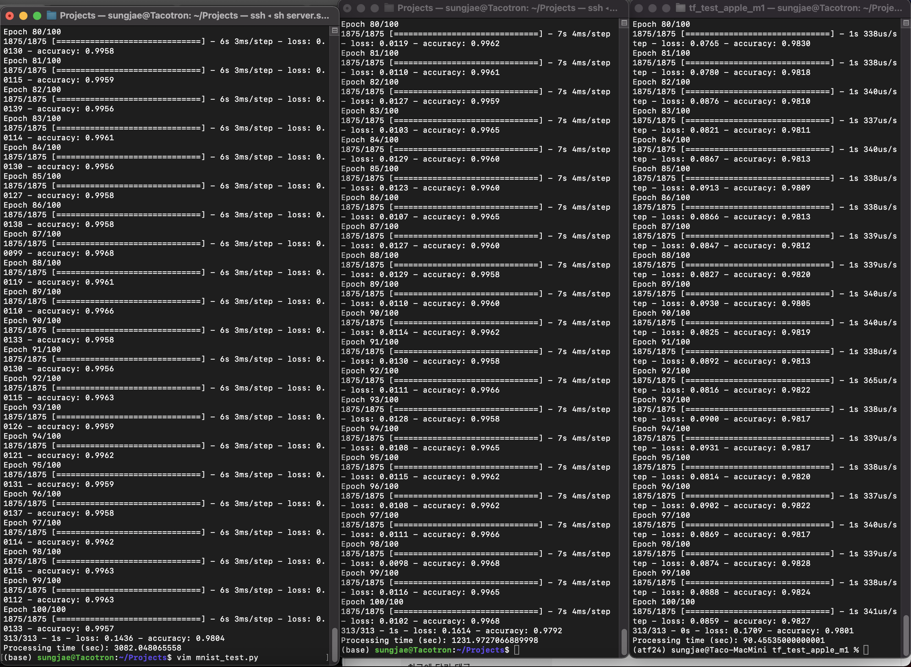

# Test Apple M1 Chip on Tensorflow

This is my small experiment on the Apple M1 chip.
In the case of small MLPs, M1 is extremely fast.
It looks very well optimized for neural nets and machine learning frameworks.
My test code is available in this repo.

## Experiment result

|Device               |Device model                                          |#UsedDevices|Duration (sec)|Relative duration|
|---------------------|------------------------------------------------------|------------|--------------|-----------------|
|RTX 2080 Ti          |NVIDIA GeForce RTX 2080 Ti (single-GPU)               |1           |3082.05       |34.06            |
|Intel Xeon Silver CPU|Intel(R) Xeon(R) Silver 4116 CPU @ 2.10GHz (multi-CPU)|multi(48)   |1231.97       |13.61            |
|Apple M1             |Apple M1 (multi-CPU)                                  |multi(4)    |90.50         |1                |

## Experiment screenshot

